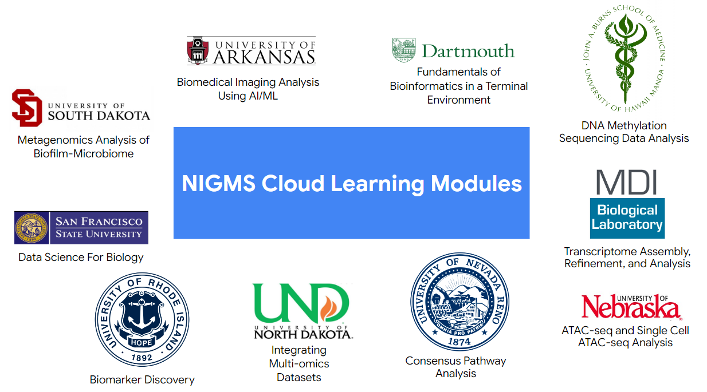

# **National Institute of General Medical Sciences Cloud Learning Modules**

# Introduction

This repository aims to teach students, researchers, and clinicians, among others, how to utilize the power of cloud technology for the benefit of life sciences applications and research. Here we present 26 cloud learning modules that represent a unique use case or scientific workflow. Types of data used across the modules include but are not limited to genomics, methylomics, transcriptomics, proteomics, and medical imaging data across formats such as FASTA/FASTQ, SAM, BAM, CSV, PNG, and DICOM. Learning modules range in areas from introductory material to single-omics approaches, multi-omics techniques, single cell analysis, metagenomics, and AI/ML imaging applications. 

These modules run in Microsoft Amazon Web Services, Microsoft Azure, and Google Cloud. All modules will be available across the three cloud platforms in 2027, but you may notice that a given module is only available in one or two of these platforms at this time. You can run these modules in any cloud account, but we encourage users to request access to an [NIH Cloud Lab](https://cloud.nih.gov/resources/cloudlab/) account for an optimal experience. 

To get started with any of the cloud platforms, visit the NIH Cloud Lab Jumpstart Pages for [AWS](https://cloud.nih.gov/resources/cloudlab/aws-jumpstart/), [Azure](https://cloud.nih.gov/resources/cloudlab/azure-jumpstart/), or [Google Cloud](https://cloud.nih.gov/resources/cloudlab/google-cloud-jumpstart/), or visit the tutorial pages: [AWS](https://github.com/STRIDES/NIHCloudLabAWS), [Azure](https://github.com/STRIDES/NIHCloudLabAzure), [GCP](https://github.com/STRIDES/NIHCloudLabGCP). 

:exclamation: _If you require support at any time, please [open an issue on GitHub](https://docs.github.com/en/issues/tracking-your-work-with-issues/creating-an-issue) for the module in question, or [send us an informative email](https://stackoverflow.com/help/how-to-ask) at CloudLab@nih.gov._

# Table of Contents
+ [Available Modules](#modules)
+ [Recomended Learning Pathways](#pathways)
+ [Cloud Technology Utilized](#cloud-technology-utilized)
+ [Cloud Module Prerequisites](#cloud-module-prerequisites)
+ [Resources](#gcp)
+ [Alternative Data Sources](#data)

# Available Modules 

*The 26 topics and their authors are listed here. If you would like guidance on what order to complete them in, jump to the recommended learning pathways in the next section.*

+ [Fundamentals of Bioinformatics](https://github.com/NIGMS/Fundamentals-of-Bioinformatics) - Dartmouth College
+ [DNA Methylation Sequencing Analysis with WGBS](https://github.com/NIGMS/DNA-Methylation-Sequencing-Analysis-with-WGBS) - University of Hawaii at Manoa
+ [Transcriptome Assembly Refinement and Applications](https://github.com/NIGMS/Transcriptome-Assembly-Refinement-and-Applications) - MDI Biological Laboratory
+ [RNAseq Differential Expression Analysis](https://github.com/NIGMS/RNA-Seq-Differential-Expression-Analysis) - University of Maine
+ [Proteome Quantification](https://github.com/NIGMS/Proteome-Quantification) - University of Arkansas for Medical Sciences
+ [ATAC-Seq and Single Cell ATAC-Seq Analysis](https://github.com/NIGMS/ATAC-Seq-and-Single-Cell-ATAC-Seq-Analysis) - University of Nebraska Medical Center
+ [Consensus Pathway Analysis in the Cloud](https://github.com/NIGMS/Consensus-Pathway-Analysis-in-the-Cloud) - University of Nevada Reno
+ [Integrating Multi-Omics Datasets](https://github.com/NIGMS/Integrating-Multi-Omics-Datasets) - University of North Dakota
+ [Metagenomics Analysis of Biofilm-Microbiome](https://github.com/NIGMS/Metagenomics-Analysis-of-Biofilm-Microbiome) - University of South Dakota
+ [Introduction to Data Science for Biology](https://github.com/NIGMS/Introduction-to-Data-Science-for-Biology) - San Francisco State University
+ [Analysis of Biomedical Data for Biomarker Discovery](https://github.com/NIGMS/Analysis-of-Biomedical-Data-for-Biomarker-Discovery) - University of Rhode Island
+ [Biomedical Imaging Analysis using AI/ML approaches](https://github.com/NIGMS/Biomedical-Imaging-Analysis-using-AI-ML-Approaches) - University of Arkansas

## Recommended Learning Pathways 

:sparkles: _We put together these learning pathways to help orient you to using the Sandbox modules. Before starting on any of the individual modules, we recommend you complete all the steps in the Prerequisites section and only continue once you are able to check off these key skills._

**Prerequisites: Introduction to GCP**

   _Here are some GCP prerequisites you should make sure you can complete before diving into the modules. These will give you the necessary cloud computing skills to run the training modules such as launching a VM, cloning modules from GitHub, and more. If anything looks unfamiliar, follow the link to view documentation on that subject. After reading the documentation in the links below, complete the simple tasks described in the steps below as a knowledge check on what you just learned. Complete each step in order to learn the key skills you need to complete the learning modules in the next section!_
   - STEP 1: [Select your GCP Project](https://github.com/NIGMS/NIGMS-Sandbox/blob/main/docs/open_GCP_project.md)
   - STEP 2: [Navigate to Vertex AI and Launch an Instance](https://github.com/STRIDES/NIHCloudLabGCP/blob/main/docs/vertexai.md). Enable idle-shutdown after 15 minutes of inactivity.
   - STEP 3: [Change your Notebook Kernel](https://cloud.google.com/vertex-ai/docs/workbench/managed/create-managed-notebooks-instance-console-quickstart)
   - STEP 4: [Enable the Google Batch and Big Query APIs](https://cloud.google.com/apis/docs/getting-started#enabling_apis)
   - STEP 5: [Read our Billing Guide](https://github.com/STRIDES/NIHCloudLabGCP/blob/main/docs/How%20to%20Create%20Labels%20and%20GCP%20Billing%20Report.docx.pdf). Generate a billing report for the last 30 days.
   - STEP 6: Review [this overview](https://github.com/STRIDES/NIHCloudLabGCP/blob/main/docs/containers.md) of pushing and pulling containers. Try to spin up a Vertex AI notebook from this container path: `us-east4-docker.pkg.dev/nih-cl-shared-resources/nigms-sandbox/nvidiaforVertex AI-rapids-22.12-cuda11.5-runtime-ubuntu20.04-py3.9@sha256:bb6703315633f21281e8caceed811f74822564a63ede01953664fe8d58b0c658`. Review [these instructions](https://github.com/NIGMS/ATAC-Seq-and-Single-Cell-ATAC-Seq-Analysis) for help.
   - STEP 7: Clone this GitHub repository into a Vertex AI Notebook Instance using [the command line](https://docs.github.com/en/repositories/creating-and-managing-repositories/cloning-a-repository) or the [Vertex AI user interface](https://cloud.google.com/vertex-ai/docs/workbench/user-managed/save-to-github).
   - STEP 8: Review how to [open a GitHub issue](https://docs.github.com/en/issues/tracking-your-work-with-issues/creating-an-issue). If you have a question or a suggested enhancement, feel free to open an issue for this repository or for the module you are having trouble with. You can also email us at `CloudLab@nih.gov`.
   - STEP 9: Read over the [NIH Cloud Lab README](https://github.com/STRIDES/NIHCloudLabGCP/tree/main) to become familiar with additional Cloud services that may be needed during these modules. Pay special attention to Google Cloud Storage and Cost Optimization.

After completing this prerequisite learning path, you should be able to:
   + Navigate the GCP console
   + Use Vertex AI Notebook instances
   + Copy data to and from a Google Cloud Storage Bucket
   + Enable APIs
   + Understand Billing
   + Pull container images and launch an instance from a container
   + Use GitHub repositories.

:surfer: _You are now ready to start analyzing data!_

We have organized the rest of the learning pathways by scientific topic area and ordered them according to technical complexity within each pathway. Our ordering is only based on the number and complexity of GCP services used and has no bearing on the difficulty of the scientific content. We recommend you being with Introductory modules within a given scientific interest area, and then progress to the more advanced modules as you gain key skills. 
+ Introductory modules :seedling: use only Jupyter notebooks within Vertex AI and sometimes Google Cloud Storage. Upon completion, users should be comfortable starting a Vertex AI instance and with copying data to and from Google Cloud Storage. 
+ Advanced modules :deciduous_tree: include additional functionality such as launching a notebook from a custom Docker container, making API calls from with the notebook to Google Batch, Life Sciences API and BigQuery, and using GPU-enabled machine types. Upon completion of advanced modules, users should be comfortable interacting with additional GCP services from within the Verted AI interface.

**Introduction to Biomedical Data Science and Machine Learning**
   + :seedling: [Introduction to Data Science for Biology](https://github.com/NIGMS/Introduction-to-Data-Science-for-Biology) - San Francisco State University
   + :seedling: [Consensus Pathway Analysis in the Cloud](https://github.com/NIGMS/Consensus-Pathway-Analysis-in-the-Cloud) - University of Nevada Reno
   + :seedling: [Analysis of Biomedical Data for Biomarker Discovery](https://github.com/NIGMS/Analysis-of-Biomedical-Data-for-Biomarker-Discovery) - University of Rhode Island
   + :deciduous_tree: [Biomedical Imaging Analysis using AI/ML approaches](https://github.com/NIGMS/Biomedical-Imaging-Analysis-using-AI-ML-Approaches) - University of Arkansas
  
After completing this learning path, you should be able to do comprehensive data science analysis on GCP with a variety of bioinformatics data sources. You skills now include downloading, processing, and visualizing data, calculating statistically significant variables, and building machine learning models with real biomedical data.
     
**Introduction to Bioinformatics and Multi-Omics**
   + :seedling:[Fundamentals of Bioinformatics](https://github.com/NIGMS/Fundamentals-of-Bioinformatics) - Dartmouth College
   + :seedling:[Proteome Quantification](https://github.com/NIGMS/Proteome-Quantification) - University of Arkansas for Medical Sciences
   + :deciduous_tree: [DNA Methylation Sequencing Analysis with WGBS](https://github.com/NIGMS/DNA-Methylation-Sequencing-Analysis-with-WGBS) - University of Hawaii at Manoa
   + :deciduous_tree: [Integrating Multi-Omics Datasets](https://github.com/NIGMS/Integrating-Multi-Omics-Datasets) - University of North Dakota

After completing this learning path, you should be comfortable analyzing bioinformatics data on the command line in a cloud environment and integrating -omics data to understand biological insight. These skills can be applied to a wide variety of Omics datasets in the subsequent sections.
     
**Introduction to Genomic Analysis**
   + :deciduous_tree: [ATAC-Seq and Single Cell ATAC-Seq Analysis](https://github.com/NIGMS/ATAC-Seq-and-Single-Cell-ATAC-Seq-Analysis) - University of Nebraska Medical Center
   + :deciduous_tree: [Metagenomics Analysis of Biofilm-Microbiome](https://github.com/NIGMS/Metagenomics-Analysis-of-Biofilm-Microbiome) - University of South Dakota

After completing this learning path, you now have experience with specialized genomics and metagenomics analysis. These tools differ from standard Omics analysis in the highly specialized tools they use, which you can now deploy in a GCP environment.
     
**Introduction to RNAseq and Transcriptome Assembly**
   + :deciduous_tree: [RNAseq Differential Expression Analysis](https://github.com/NIGMS/RNA-Seq-Differential-Expression-Analysis) - University of Maine
   + :deciduous_tree: [Transcriptome Assembly Refinement and Applications](https://github.com/NIGMS/Transcriptome-Assembly-Refinement-and-Applications) - MDI Biological Laboratory

After completing this learning path, you are able to do a full analysis of RNA-seq data, including assembling a transcriptome and identifying differentially expressed genes. These are computationally intensive tools which the Cloud enables you to conduct in a scalable manner. 

_That concludes our section on Learning Pathways. The rest of the README will walk you through some of the technical details of each module, in particular focusing on compute environments and machine types, as well as additional resources to help you continue your learning journey!_

## Cloud Technology Utilized 

The 12 NIGMS cloud modules utilize the following GCP services:  Cloud Storage, gcsfuse, Vertex AI Workbench, Artifact Registry, Cloud Build, BigQuery, and Cloud Lifesciences API*. Technologies that support the cloud services mentioned include JupyterLab, Docker, Git, and life sciences software libraries such as [Bioconductor](https://www.bioconductor.org/) in R and the [Bioconda](https://bioconda.github.io/) Anaconda channel in Python.

*Google Batch is a newer managed service that provides similar functionality to the Google Life Sciences API.*

## Cloud Module Environment Requirements 

Each module has different infrastructure and software requirements. While many of the GCP services required overlap there are specifications that users should keep in mind before they start their self paced learning. More details can be found within each individual repository README which are linked to in each respository title. An overview is provided below: 

1. [Fundamentals of Bioinformatics](https://github.com/NIGMS/Fundamentals-of-Bioinformatics/blob/main/README.md)
, Dartmouth College 
   * default machine type: n1-standard-4
   * Python 3 kernel
   * env.yml contains necessary software requirements for easy installation

2. [DNA Methylation Sequencing Analysis with WGBS](https://github.com/NIGMS/DNA-Methylation-Sequencing-Analysis-with-WGBS/blob/main/README.md), University of Hawaii at Manoa
   * default machine type: n1-standard-4
   * Python 3 kernel
   * Nextflow Service Account (*if executed outside of Cloud Lab*)

3. [Transcriptome Assembly Refinement and Applications](https://github.com/NIGMS/Transcriptome-Assembly-Refinement-and-Applications/blob/master/README.md), MDI Biological Laboratory
   * default machine type: n1-highmem-16
   * Python 3 kernel
   * Nextflow Service Account (*if executed outside of Cloud Lab*)

4. [RNAseq Differential Expression Analysis](https://github.com/NIGMS/RNA-Seq-Differential-Expression-Analysis/blob/master/README.md), University of Maine
   * default machine type: n2-standard-4
   * R 4.2 kernel

5. [Protein Quantification](https://github.com/NIGMS/Proteome-Quantification/blob/master/README.md), University of Arkansas for Medical Sciences
   * R 4.2 kernel

6. [ATAC-Seq and Single Cell ATAC-Seq Analysis](https://github.com/NIGMS/ATAC-Seq-and-Single-Cell-ATAC-Seq-Analysis/blob/main/README.md), University of Nebraska

   Modules 1-3: 
   * default machine type: n1-standard-4
   * Python 3 kernel

   Module 4:
   * T4 GPU attached
   * RAPIDS Vertex AI image

7. [Consensus Pathway Analysis in the Cloud](https://github.com/NIGMS/Consensus-Pathway-Analysis-in-the-Cloud/blob/master/README.md), University of Nevada Reno
   * default machinetype: n1-standard-4
   * R 4.2 kernel

8. [Integrating Multi-Omics Datasets](https://github.com/NIGMS/Integrating-Multi-Omics-Datasets/blob/master/README.md), University of North Dakota
   * default machinetype: n1-standard-4
   * R 4.2 kernel
   * conda_environment.yml contains necessary software(s)
   * Nextflow Service Account (*if executed outside of Cloud Lab*)

9. [Metagenomics Analysis of Biofilm-Microbiome](https://github.com/NIGMS/Metagenomics-Analysis-of-Biofilm-Microbiome/blob/master/README.md), University of South Dakota
   * default machinetype: n1-standard-8
   * Python 3 kernel
   * custom service account
   * custom machine image
   * requirements.yaml

10. [Introduction to Data Science for Biology](https://github.com/NIGMS/Introduction-to-Data-Science-for-Biology/blob/master/README.md), San Francisco State University
   * default machine type: n1-standard-4
   * Python 3 kernel

11. [Biomarker Discovery with Machine Learning](https://github.com/NIGMS/Analysis-of-Biomedical-Data-for-Biomarker-Discovery/blob/master/README.md), University of Rhode Island
   * default machine type: n1-standard-4
   * R 4.2 kernel

12. [Biomedical Imaging Analysis using AI/ML approaches](https://github.com/NIGMS/Biomedical-Imaging-Analysis-using-AI-ML-Approaches/blob/master/README.md), University of Arkansas
   * default machine type: n1-standard-4
   * Python 3 kernel

Some of the modules above require detailed changes to the cloud configuration in order to sucessfully execute them. For these modules, several "How To" documents have been developed in this repository to help users accomplish the each prerequisite listed above: 

* [How to create conda virtual environments to use as Jupyter kernels](https://github.com/NIGMS/NIGMS-Sandbox/blob/main/docs/HowToUseCondaEnvsAsKernels.ipynb)
* [How to mount cloud storage buckets in your Vertex AI notebook with gcsfuse](https://github.com/NIGMS/NIGMS-Sandbox/blob/main/docs/HowToMountABucketWithGcsfuse.ipynb)
* [How to create custom images for Vertex AI](https://github.com/STRIDES/NIHCloudLabGCP/blob/main/docs/containers.md)

## Resources 
In the below section we define the GCP services utilized across the learning modules. You can find an additional curated list of GCP tutorials in this repository under docs: [GCP Resources detailed](./docs/GoogleCloudPlatformResources.md)

### Google Cloud Platform resources 

1. **IAM - https://cloud.google.com/iam/docs/overview** \
IAM in GCP allows you to manage access control by defining who (identity) has what access (role) for which resource. In IAM, permission to access a resource isn't granted directly to the end user. Instead, permissions are grouped into roles, and roles are granted to authenticated principals. 

2. **Billing - https://cloud.google.com/billing/docs** \
To use Google Cloud services, you must have a valid Cloud Billing account, and must link it to your Google Cloud projects. Your project's Google Cloud usage is charged to the linked Cloud Billing account. When you sign up for [NIH Cloud Lab](https://cloud.nih.gov/resources/cloudlab/) you will access an account loaded with credits for you to experiment with.

3. **Cloud Storage - https://cloud.google.com/storage/docs/introduction** \
Cloud Storage is a service for storing your objects in Google Cloud. An object is an immutable piece of data consisting of a file of any format. You store objects in containers called buckets. All buckets are associated with a project, and you can group your projects under an organization. 

4. **Vertex AI - https://cloud.google.com/vertex-ai/docs/start/introduction-unified-platform** \
Vertex AI brings AutoML and AI Platform together into a unified API, client library, and user interface. AutoML lets you train models on image, tabular, text, and video datasets without writing code, while training in AI Platform lets you run custom training code. With Vertex AI, both AutoML training and custom training are available options. Whichever option you choose for training, you can save models, deploy models, and request predictions with Vertex AI. Vertex AI implements JupyterLab in Vertex AI Workbench. 

5. **Cloud Build - https://cloud.google.com/build/docs** \
Cloud Build is a service that executes your builds on Google Cloud infrastructure. Cloud Build can import source code from Cloud Storage, Cloud Source Repositories, GitHub, or Bitbucket, execute a build to your specifications, and produce artifacts such as Docker containers or Java archives.

6. **Cloud Life Sciences API - https://cloud.google.com/life-sciences/docs/process-genomic-data** \
Cloud Life Sciences is a suite of services and tools for managing, processing, and transforming life sciences data. Cloud Life Sciences (formerly Google Genomics) enables the life sciences community to process biomedical data at scale. Cost effective and supported by a growing partner ecosystem, Cloud Life Sciences lets you focus on analyzing data and reproducing results.

7. **Operations (formerly Stackdriver) https://cloud.google.com/stackdriver/docs** \
Operations, formerly known as Stackdriver, is composed of Monitoring and Logging. Cloud Monitoring collects metrics, events, and metadata from Google Cloud, Amazon Web Services (AWS), hosted uptime probes, and application instrumentation. Using the BindPlane service, you can also collect this data from over 150 common application components, on-premise systems, and hybrid cloud systems. Google Cloud's operations suite ingests that data and generates insights via dashboards, charts, and alerts. BindPlane is included with your Google Cloud project at no additional cost.

Cloud Logging is a fully managed service that allows you to store, search, analyze, monitor, and alert on logging data and events from Google Cloud and Amazon Web Services. You can collect logging data from over 150 common application components, on-premises systems, and hybrid cloud systems.

## Alternative Data Sources 

Where can users get similar data to run through these tutorials with their own datasets or alternative datasets of interest? 

1. SRA \
Sequence Read Archive (SRA) data, available through multiple cloud providers and NCBI servers, is the largest publicly available repository of high throughput sequencing data. The archive accepts data from all branches of life as well as metagenomic and environmental surveys. SRA stores raw sequencing data and alignment information to enhance reproducibility and facilitate new discoveries through data analysis. Learn more about accessing SRA data through GCP from the [NIH Cloud Lab Tutorial Section](https://github.com/STRIDES/NIHCloudLabGCP/tree/main#download-data-from-the-sequence-read-archive-sra-). 

2. GEO \
GEO is a public functional genomics data repository supporting MIAME-compliant data submissions. Array- and sequence-based data are accepted. Tools are provided to help users query and download experiments and curated gene expression profiles. Learn more [here](https://www.ncbi.nlm.nih.gov/geo/)

3. MEDMNIST \
The MedMNIST v2 dataset consists of 12 pre-processed 2D datasets and 6 pre-processed 3D datasets from selected sources covering primary data modalities (e.g., X-Ray, OCT, Ultrasound, CT, Electron Microscope), diverse classification tasks (binary/multi-class, ordinal regression and multi-label) and data scales (from 100 to 100,000). For simplicity, we call the collection of all 2D datasets as MedMNIST2D, and that of 3D as MedMNIST3D. MedMNIST can be downloaded through pip. Learn more [here](https://medmnist.com/)

4. Google Public Dataset Program - https://services.google.com/fh/files/misc/public_datasets_one_pager.pdf \
Google Cloud Public Datasets facilitate access to high-demand public datasets making it easy for you to access and uncover new insights in the cloud. By hosting these datasets in BigQuery and Google Cloud Storage, you can seamlessly experience the full value of Google Cloud with the touch of a button. Explore public datasets stored in [Cloud Storage](https://cloud.google.com/storage/docs/access-public-data) and in [BigQuery](https://cloud.google.com/bigquery/public-data).
