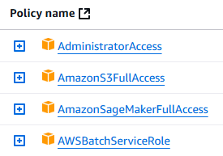
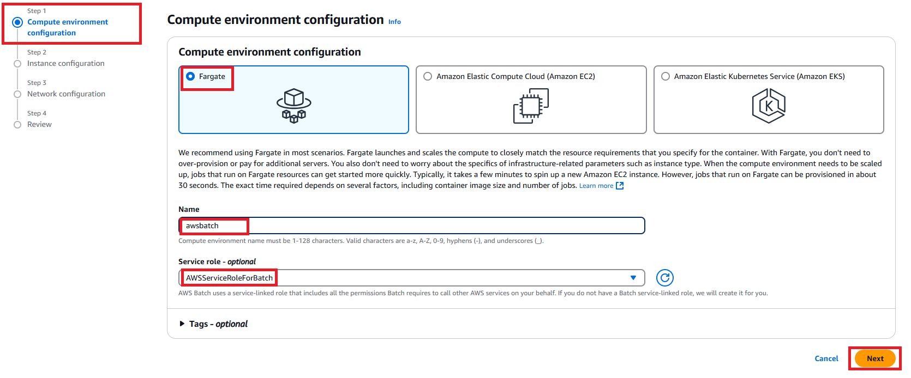
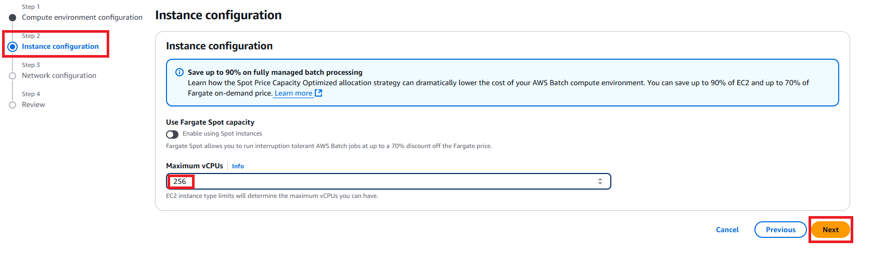
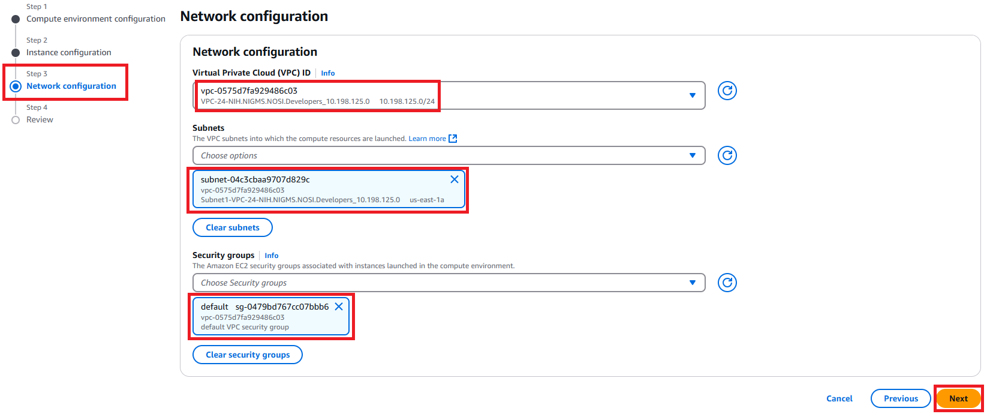
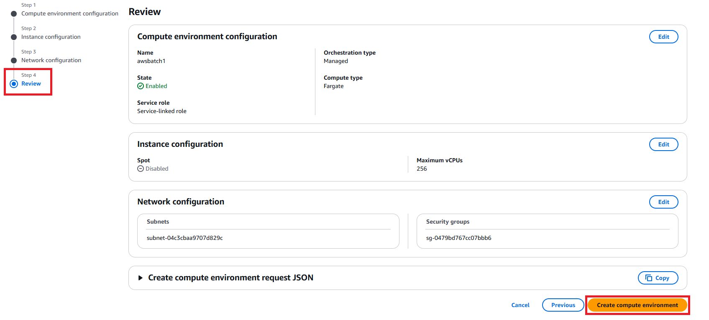
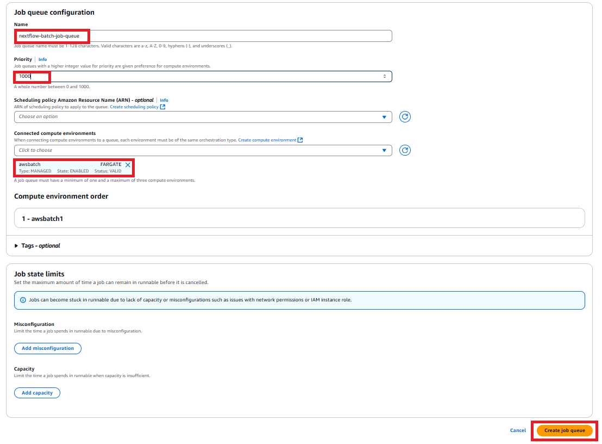
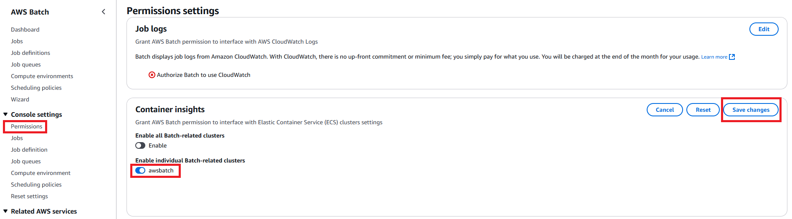

# AWS Batch Setup

## **0-Before You Begin**

- Ensure you have a VPC, subnets, and security group set up before continuing the AWS Batch setup.
- Attach following policies to your SageMaker notebook instance:

## **1-Creating a Compute Environment**

Naviate to **'AWS Batch'** in the console. Within AWS Batch on the left side menu navigate to **'Compute environments'**, select **'Create'**.  
For this tutorial we will be working with EC2, select 'EC2'.
- Select \"Managed\" for Orchestration type.
- Enter a name for your compute environment
- Under service role select "AWSServiceRoleForBatch"
- Under Instance role select "AWSServiceRoleForBatch"
- Click 'Next'

We have set the fields in the image below to default. Click Next.

For Network Configuration select your VPC, subnets, and security groups you would like to utilize. This will allow AWS Batch to create instances that can communicate with each other and have access to acceptable networks.

The last step is to review all the configuration made to your compute environment. Once you are satisfied click "Create compute environment".

## **2-Creating a Job Queue**

Now that we have created a compute environment lets create a job queue. Job queues help Batch to stay organized by holding jobs until they can be scheduled to run in a compute environment.

In the AWS Batch console, go to the left side menu, click "Job queues" and click "Create".

- Set orchestration type to EC2
- Give your queue a name and set its priority. for this tutorial we have se it to '1000' to have the highest priority
- Associate the compute environment you created in the pervious step.
- Review and create the job queue.

## **3-Applying Permissions**

For this step we are enabling AWS Batch permissions on EC2 clusters.

- On the left side menu under 'Control settings' click 'Permissions'.
- Next to Container insights click 'Edit'.
- Using the toggles select with compute environment should have these permissions and click 'Save changes'.

