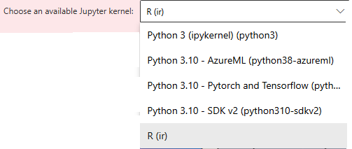

# How to Create Azure ML Notebooks

This guide will show you how to create a notebook in Azure Machine Learning Studio.

1. First navigate to the [Azure ML Homescreen](https://ml.azure.com/home) and then select **New workspace** under **+ Create**.

  

2. Next choose your resource group, give the workspace a descriptive name, and select your region. Other selections should be optional or pre-filled.

  

3. It will take a minute or two for the new workspace to be ready.  When it is ready, click **Launch studio**.

  

4. In the workspace click **+New** then **Notebook** from the dropdown menu.

  

5. Select **Create compute**.

  

6. Finally, give a unique compute name, select your **virtual machine size**, and click **Review + Create**.

  

7. To clone an appropriate repository from GitHub.com, click **Terminal**.

 

8. Run `git clone ...`

 

9. This will download the repository directory to your notebook.

 

 10. Finally, choose an appropriate Jupyter kernel.

 