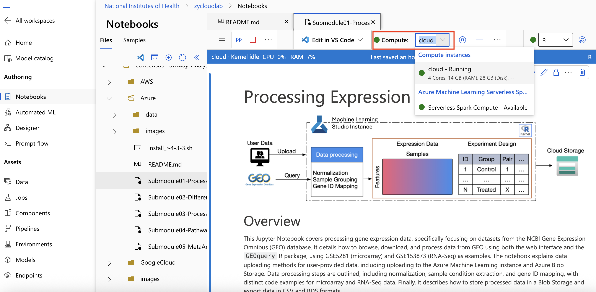

# How to Create Azure ML Notebooks

This guide will show you how to create a notebook in Azure Machine Learning Studio.

1. First navigate to the [Azure ML Homescreen](https://ml.azure.com/home) and then select **New workspace** under **+ Create**.

  

2. Next choose your resource group, give the workspace a descriptive name, and select your region. Other selections should be optional or pre-filled.

  

3. It will take a minute or two for the new workspace to be ready.  When it is ready, click **Launch studio**.

  

4. In the workspace click **+New** then **Notebook** from the dropdown menu.

  

5. Select **Create compute**.

  

6. Finally, give a unique compute name, select your **Compute Instance**, and click **Review + Create**.

  

## Azure Notebooks UI vs. JupyterLab
You have two options to interact with the notebook files: using the Azure Notebooks UI setting or the JupyterLab setting. The steps below will highlight how to clone a GitHub repo and run Jupyter files in each setting.

**Option 1: Azure Notebooks UI**
1. To clone an appropriate repository from GitHub.com, click **Terminal**.

 

2. Run `git clone ...`, follow up with the URL of the GitHub repo you would like to clone (example: `git clone https://github.com/NIGMS/NIGMS-Sandbox.git`). Hit enter.

 

3. This will download the repository directory to your notebook.

 

4. Now you should see your files listed under the **Files** tab. Click the file to open them and verify that it is running by navigating to **Compute**. Ensure there is a green dot next to your instance name and that the status displays **"Running.".**

 
 

5. Choose an appropriate Jupyter kernel (e.g., R, Python, etc.).

6. Click the play button next to each cell to run the code or markdown cell.

**Option 2: JupyterLab**

1. After you have created your instance, navigate to **Compute** in the left side menu.
2. Select your instance name.
3. Confirm that your instance is running; if it's not, click the **Start** button.
4. Click **JupyterLab**.
   

5. Click **Terminal** in the launcher and run `git clone ...`, follow up with the URL of the GitHub repo you would like to clone (example: `git clone https://github.com/NIGMS/NIGMS-Sandbox.git`). Hit enter.

6. Double-click to open files located in the left side bar.

7. Select your kernel (default is Python).

8. Select a cell and click the play button at the top to run the code or markdown cell.
