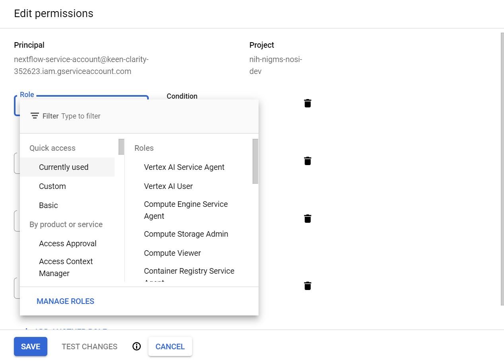

# How to create a nextflow service account in GCP


## 1. Create a Nexflow Service Account


- Enable the Cloud Life Sciences, Compute Engine, and Cloud Storage APIs by searching each of the GCP products and clicking 
- Click the navigation menu , go to IAM then click Service Accounts


- Select  

- Type in 'nextflow-service-account' as the service account name and press 'Done'
- On the AMI & Admin menu click 'IAM' then click  next to the nextflow service account

- Add the following roles and click 'Save':
 

__Roles:__

    - lifesciences.workflowsRunner
    - iam.serviceAccountUser
    - serviceusage.serviceUsageConsumer
    - storage.objectAdmin
    - compute.instances.get (for M97 deep learning images, M98 images reverse this requirement)


## 2. Add Service Account to Notebook Permissions


When creating a notebook you can edit the permissions to utilze the nextflow service account.
- Using the 'IAM & Admin' menu on the left click 'Service Accounts' (if you aren't there already) locate your nextflow service account and copy the entire email name
- Start to create your notebook and edit the Permissions section by unclicking 'Use Compute Engine default service account' and enter your service account email.


- then click 'Create'

__WARNING__: Please __do not create a service key__ if instructed by any tutorial. API keys are generally not considered secure; they are typically accessible to clients, making it easy for someone to steal an API key. Once the key is stolen, it has no expiration, so it may be used indefinitely, unless the project owner revokes or regenerates the key. 

```python

```
