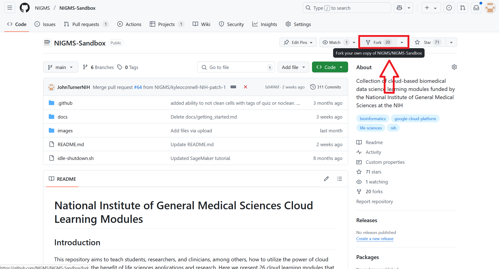
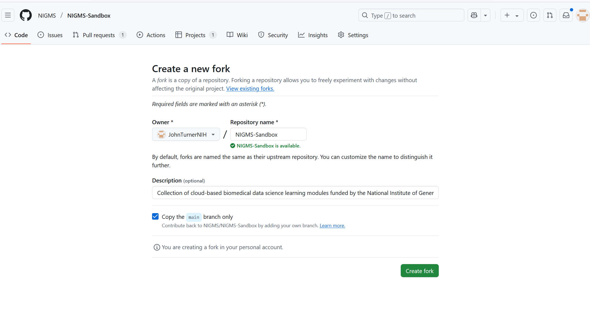
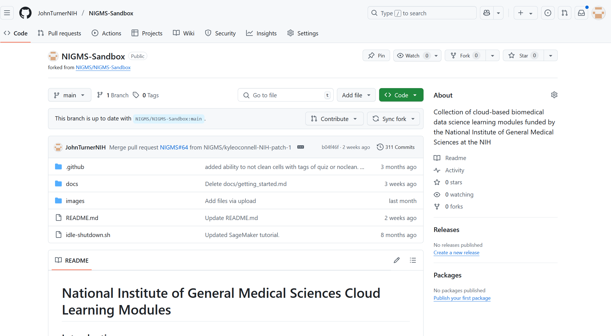

# Forking a Github Repository

Navigate to the github repository you would like to edit. For this example we are forking the NIGMS-Sandbox repository. Click on the fork button near the top, image below shows it

You can then choose where you would like this fork to be placed. If you are working on a small patch alone you can select your personal github otherwise move it to whatever organization 
will work on the modifications. 

After you click create fork the repository will be copied to the location chosen and then openned in your brwoser

From here you can make the modifications required to your forked copy and then use a [pull request](https://github.com/NIGMS/NIGMS-Sandbox/blob/main/docs/HowToPullRequest.md) to request that the changes be merged into the original repository.