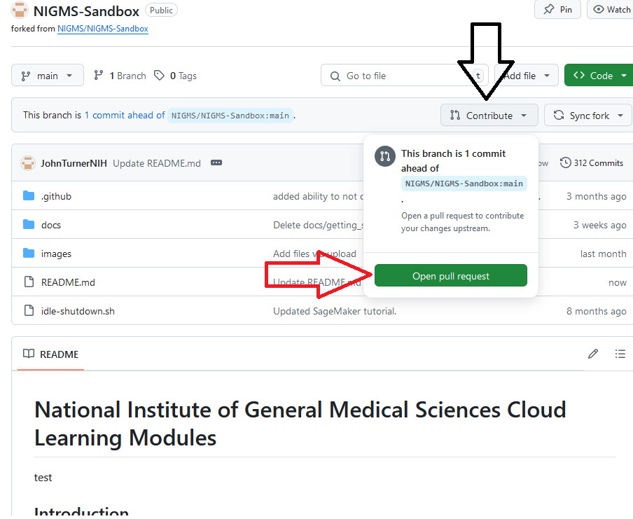
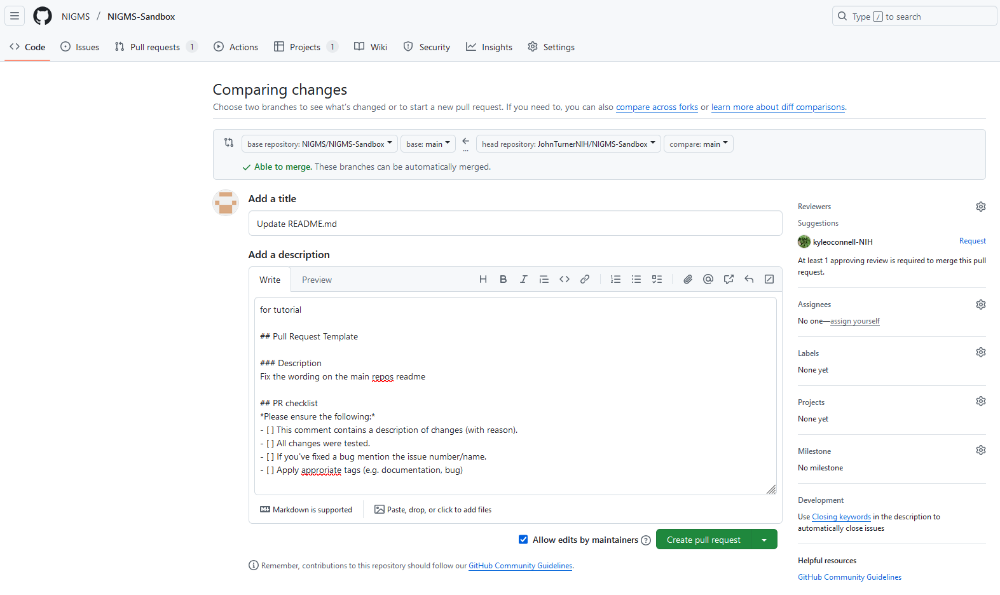
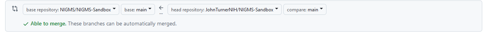
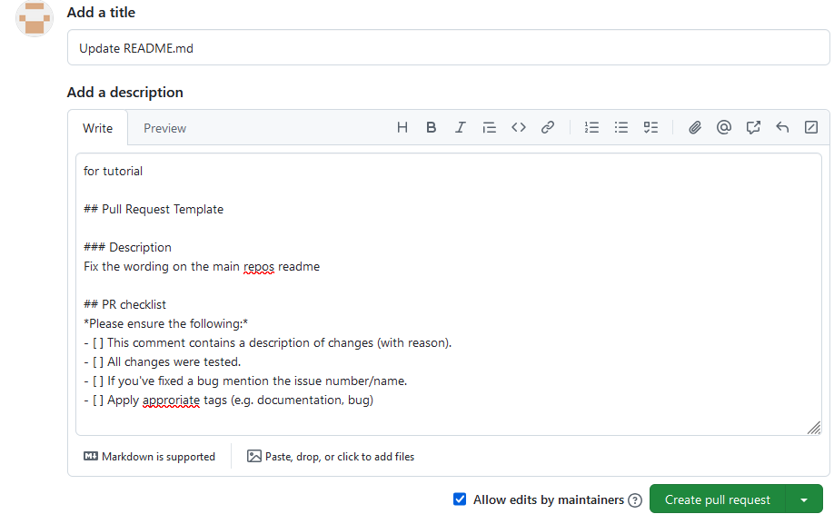

# Github Pull Request

## **1-Creating a Pull Request**

This guide assumes that you have followed the guide for forking a repository and have made modifications to your local fork that you intend to request be merged
into the original repository. To start you go to your github repository main page and select the contribute button and then select "Open pull request"

This will take you to the pull request form for the main repository which should contain a template for the information that needs to be filled out to create a 
successful pull request.

The main interface is broken into two main sections

The top section is a branch selection dialog that should automatically be filled out properly. On the right is the repository that you are requesting the
pull request to, as you clicked this from your repository it should be the NIGMS equivalent. Next is the branch of that repository which should be main.
The next section is the repository you are requesting a pull request from, this should be the repository that you modified and then the branch that your modification 
is on.

The final section is the location where you add a title for your particular request and a description of what changes your pull request has made. A good pull request
will explain exactly what problem you are solving with your modification, why it should be merged, and what has been changed as an overview. The template for NIGMS 
repositories also has a checklist that should be completed before a pull request is submitted.

