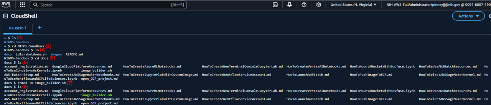
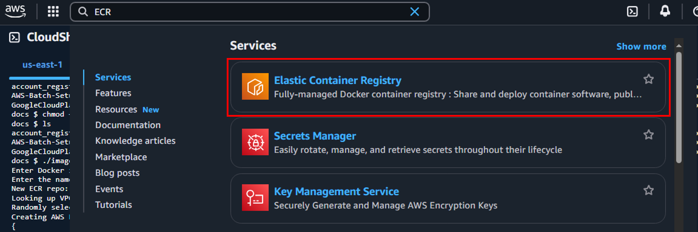

# Using Amazon SageMaker AI

AWS offers different types of Notebook instances and now two SageMaker products. For these tutorials please use Amazon SageMaker AI. Within this offering, you will see  SageMaker Notebook Instances and SageMaker Studio. SageMaker Notebook Instances offer the most flexibility in terms of installing local software, while Studio allows for several IDEs and launching from custom containers. Studio is primarily designed for building and deploying AI models, but in our case, it allows us to launch from custom containers that allow you to run modules without installing any software. As such, if you are using a module that installs software or command line tools, follow the instructions for [1) SageMaker AI Notebook Instances](#1-using-sagemaker-ai-notebook-instances) and pay attention to the README for each module to select the correct machine type and EBS storage. If you are running a module that launches from a container, then follow [2) SageMaker AI Studio Instances](#2-using-sagemaker-ai-studio-instances), and likewise, follow the instructions of your module's README for specifications.

&#10071; Please note that your interface may look different from the screenshots as the AWS interface continues to evolve.

-----------------------------------------
# Table of Contents
+ [Section 1: Using SageMaker AI Notebook Instances](#1-using-sagemaker-ai-notebook-instances)
+ [Section 2: Using SageMaker AI Studio Instances](#2-using-sagemaker-ai-studio-instances)
    + [PART 1: Pushing Public Container Image to Your Elastic Container Registry (ECR)](#part-1-pushing-public-container-image-to-your-elastic-container-registry-ecr)
        + [OPTION 1: Using Shell Script to Push a Public Docker Image to Private ECR](#option-1-using-shell-script-to-push-a-public-docker-image-to-private-ecr)
        + [OPTION 2: Manually Pushing a Public Docker Image to Private ECR](#option-2-manually-pushing-a-public-docker-image-to-private-ecr)
    + [PART 2: Setup a JupyterLab with a Custom Docker Image](#part-2-setup-a-jupyterlab-with-a-custom-docker-image)
    + [PART 3: Shutting Down Instances](#part-3-shutting-down-instances)
    + [PART 4: Managing Running Instances](#part-4-managing-running-instances)
    + [PART 5: Deleting Instances](#part-5-deleting-instances)

-----------------------------------------

## 1) Using SageMaker AI Notebook Instances

&#10024; If you prefer to follow the AWS documentation directly, go to [this page](https://docs.aws.amazon.com/sagemaker/latest/dg/howitworks-create-ws.html)

1. In AWS console, type **Amazon SageMaker AI** in search bar and click it:

   
 <align="center"/>
       
   

2. On the left side bar click **Notebooks**:
   
 <align="center"/>
       
   

3. Click **Create notebook instance**:
   
 <align="center"/>
       
   

4. Follow the steps below (guided by the associated image) to finish creating your notebook instance:
    - Give a unique name to your notebook <b>(1)</b>
    - Choose a notebook instance type based on the specifications of your module's README. You can view all available machine types [here](https://aws.amazon.com/ec2/instance-types/) <b>(2)</b>
    - For Platform, the default is fine unless otherwise specified in your module <b>(3)</b>
    - Click the dropdown for *Additional Configuration* <b>(4)</b>. We will do two things here:
        - For Volume size in GB, make sure to follow the instructions of your module, otherwise, give the instance 200 GB <b>(5)</b>
        - Create your Lifecycle configuration (see step 5 below) and then select it here <b>(6)</b>

  
 <align="center"/>
       
   

6. Attaching a lifecycle configuration script enables automatic VM shutdown (even if you forget to stop it manually). To do this, click the dropdown and select *Create a new lifecycle configuration*. Then, in the pop up box, paste in [this script](../idle-shutdown.sh) and click *Create configuration*. Everything else can be left as default.
   
 <align="center"/>
       
   

6. Now click **Create notebook instance**.
   
 <align="center"/>
       
   

   
7. Wait about 5 minutes until your notebook says `InService`, then click **Open JupyterLab**.
      
 <align="center"/>
       
   

9. Clone your module of interest from GitHub either using the instructions in this screenshot or [using the guidance found here](https://docs.github.com/en/repositories/creating-and-managing-repositories/cloning-a-repository).
   
 <align="center"/>
       
   

10. Select a notebook and then kernel:
   
 <align="center"/>
       
   

> **IMPORTANT**: <u>Stop</u> the kernel at end of your work to avoid getting charged. When you are finished with a module, delete the instance to prevent all future charges.

   
 <align="center"/>
       
   

#### **Video Tutorial**
You can also watch the notebook setup video below for step-by-step instructions:

        
     
     Click above image to watch notebook setup video 

----------------------------------------
## 2) Using SageMaker AI Studio Instances

> **IMPORTANT**: Before following the instructions below confirm that you are in the `us-east-1` region.

### PART 1: Pushing Public Container Image to Your Elastic Container Registry (ECR)

#### **OPTION 1:** Using Shell Script to Push a Public Docker Image to Private ECR
The steps outlined below guide you through how to push a public docker image to a private repository within your AWS account's ECR using CloudShell.
1. Navigate to the CloudShell Console
      
 <align="center"/>
          
      

2. Clone in the `NIGMS-Sandbox` repo **(1)**
      
 <align="center"/>
          
      

3. Navigate to the `docs` folder within the cloned repo directory **(2-5)**
4. List the files within the `docs` directory and find the `image_builder.sh` file (this is the relevant shell script) **(6)**
5. If the font of the `image_builder.sh` file is not green, then make the script executable by running the command `chmod +x image_builder.sh` **(7)**
6. List the `docs` directory again to confirm shell script is now executable (green font) **(8)**
      
 <align="center"/>
          
      

7. Next, run the script using the command `./image_builder.sh` **(9)**
8. When prompted enter the public image URI provided in your module's README file (e.g., `public.ecr.aws/v8e3m3v4/sagemaker/umaine-sagemaker`) **(10)**
9. The next prompt asks for a `.pem` key name, enter your key name of choice (e.g., `test-key`) **(11)**
      
 <align="center"/>
          
      

10. Once the script completes navigate to your account's ECR console. 
      
 <align="center"/>
          
      

11. Under private repository, click on the repository named `nigms-images`
      
 <align="center"/>
          
      

12. After ~15 minutes the container should show up. This can now be used as a custom image in Jupyterlab as outlined in [PART 2: Setup a JupyterLab with a Custom Docker Image](#PART-2:-Setup-a-JupyterLab-with-a-Custom-Docker-Image)
      
 <align="center"/>
          
      

#### **OPTION 2:** Manually Pushing a Public Docker Image to Private ECR
The steps outlined below guide you through how to manually push a public docker image to a private repository within your account's ECR using a notebook instance.

1. Pull a Docker image

    - In a notebook instance that you created by following the steps above, `Open JupyterLab`:
      
 <align="center"/>
          
      

    - Open Terminal:
      
 <align="center"/>
          
      

    - Pull a Docker image: `docker pull public.ecr.aws/v8e3m3v4/sagemaker-studio/r:latest`
      
 <align="center"/>
          
      

2. Create a repository in ECR

    - In AWS console, type *ECR* in search bar and then click **Elastic Container Registry**:
      
 <align="center"/>
          
      

    - Click **Create repository**:
      
 <align="center"/>
          
      

    - Give a name and then create the repository:
      
 <align="center"/>
          
      

    - Copy URI of your repository for the next part:
      
 <align="center"/>
          
      

3. Push Docker image to ECR

    - Retrieve an authentication token and authenticate your Docker client to your registry using the following command: 
      `aws ecr get-login-password --region us-east-1 | docker login --username AWS --password-stdin 664418964547.dkr.ecr.us-east-1.amazonaws.com/sagemaker/r-kernel`

      
 <align="center"/>
          
      

    - Tag your image so you can push the image to this repository using the following command: 
      `docker tag public.ecr.aws/v8e3m3v4/sagemaker-studio/r:latest 664418964547.dkr.ecr.us-east-1.amazonaws.com/sagemaker/r-kernel:latest`

      
 <align="center"/>
          
      

    - Run the following command to push this image to your newly created AWS repository: 
      `docker push 664418964547.dkr.ecr.us-east-1.amazonaws.com/sagemaker/r-kernel:latest`

      
 <align="center"/>
          
      

### PART 2: Setup a JupyterLab with a Custom Docker Image

1. In Amazon SageMaker AI, **Create domain**:
   
 <align="center"/>
       
   

2. Leave the **Quick setup** and click **Set up**:
   
 <align="center"/>
       
   

3. After having your domain ready, go to **Environment** tab and click **Attach image**:
   
 <align="center"/>
       
   

4. Under **New image**, enter and ECR image URL, click **Next**:
   
 <align="center"/>
       
   

5. Give a name to your image, select **JupyterLab image**, and **Submit**:
   
 <align="center"/>
       
   

6. In **Studio** tab, **Select Domain** and then **Open Studio**:
   
 <align="center"/>
       
   

7. Select **Jupyterlab**, and then click **Create JupyterLab Space**:
   
 <align="center"/>
       
   

8. Give a name, and then **Create space**:
   
 <align="center"/>
       
   

9. Select the custom image, instance type, define storage amount under **Storage (GB)**, and then **Run space**:
   
 <align="center"/>
       
   

10. Wait for the space to start up and then select **Open JupyterLab** once ready:
   
 <align="center"/>
       
   

#### **Video Tutorial**
You can also watch the container setup video below for step-by-step instructions for creating a domain and running from a container in SageMaker Studio:

        
     
     Click above image to watch container setup video 

### PART 3: Shutting Down Instances

1. After you are done working, go back to JupyterLab and shutoff your instance by clicking Stop:
   
 <align="center"/>
       
   

2. Wait until the status shows stopped for all unused instances:
   
 <align="center"/>
       
   

### PART 4: Managing Running Instances
To check the active resources the Running Instances section was added. Below explains where it is and how to check what is actively running. 

1. Go to **Running instances** within SageMaker Studio and make sure all instances being unused are stopped. If there are unused instances in the Running status select the associated stop action:
   
 <align="center"/>
   
   

2. Wait for the instances to stop:
   
 <align="center"/>
   
   

### PART 5: Deleting Instances
1. Go to the Domain you are seeking to delete a instance. :
   
 <align="center"/>
   
   

2. After go to **Running instances** within SageMaker Studio and make sure all instances being unused are stopped:
   
 <align="center"/>
   
   

